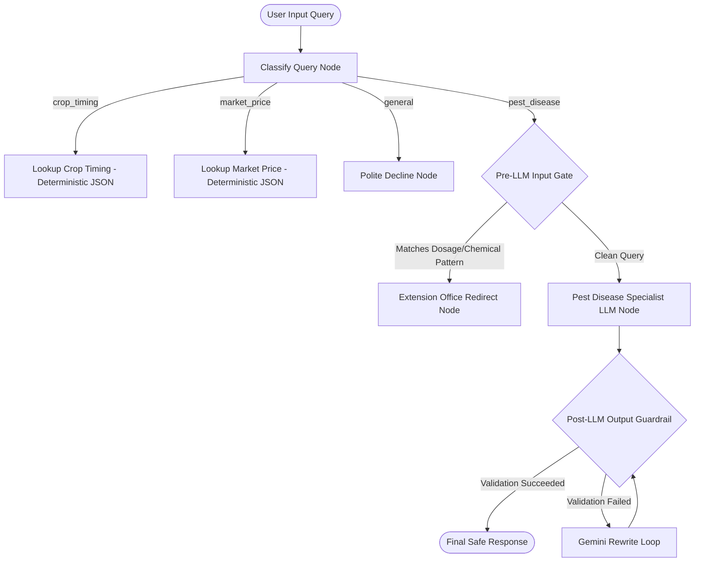

# AgriGuard - Intelligent Agro-Advisory Agent

AgriGuard is an intelligent agricultural advisory assistant built using **ADK 2.0 Graph Workflows** and powered by **Gemini 3.1-flash-lite**. It routes, classifies, and safeguards farmer queries regarding crop calendars, market prices, and plant pathology advice.

---

## 🏗️ System Architecture

The following diagram illustrates the routing and safety pipeline of AgriGuard:



---

## 📊 Data Sources

To ensure accurate, non-fabricated advice, AgriGuard uses local, deterministic JSON databases instead of LLM reasoning for calendar and pricing lookups:
* **Crop Timing Database (`data/crop_timing.json`)**: Contains regional crop timing schedules (sowing and harvesting periods) for crops like wheat, rice, and maize.
* **Market Price Database (`data/market_price.json`)**: Contains local crop market prices per metric ton.

---

## 🛡️ Guardrails and Safety Gates

AgriGuard enforces strict safety rules (no specific chemical names or numeric pesticide dosages leaked) using a dual-gate architecture:
1. **Pre-LLM Input Gate**: Deterministically intercepts user queries asking for pesticide amounts/dosages or overriding system prompts, redirecting them immediately to the agricultural extension office without calling the LLM.
2. **Post-LLM Output Gate**: Runs the `validate_response.py` script on the LLM's raw output. If specific chemical active ingredients or numeric dosages are found, a 5-step Gemini rewrite loop cleans the response.

---

## ⚙️ Local Setup and Installation

### Prerequisites
* **Python 3.10+**
* **uv**: Astral's package manager (`pip install uv`)

### Install Dependencies
Navigate to the project directory and run:
```bash
uv sync
```

### Setup API Key
Configure your Gemini API key in your terminal session:
```powershell
$env:GEMINI_API_KEY="your-gemini-api-key"
```

---

## 🚀 Running the Project

### 1. Launch the Premium Web UI
Start the local FastAPI server serving the premium glassmorphic chat interface:
```bash
uv run python app/fast_api_app.py
```
Open your browser and navigate to:
👉 **[http://localhost:8000/static/index.html](http://localhost:8000/static/index.html)**

### 2. Run Evaluations (Scorecard)
Execute custom LLM-as-judge metrics (Routing Correctness & Guardrail Containment) over 6 synthetic scenarios:
```bash
uv run python tests/eval/run_eval.py
```

### 3. Run Automated Tests
```bash
uv run pytest
```
