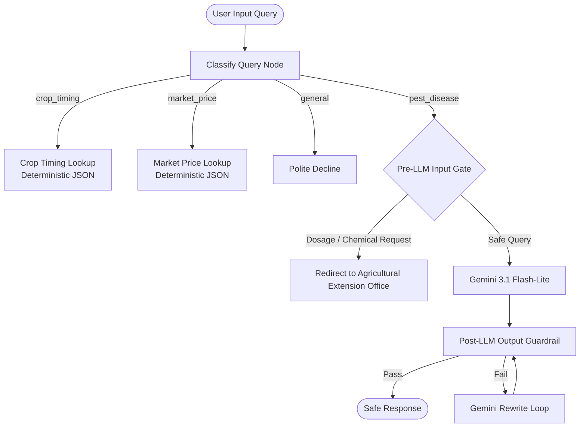

# 🌾 AgriGuard — Intelligent Agro-Advisory Agent

**AgriGuard** is an intelligent multi-agent agricultural advisory system built using **ADK 2.0 Graph Workflows** and powered by **Gemini 3.1 Flash-Lite**. It provides smallholder farmers with localized guidance on **crop timing**, **market prices**, and **pest & disease management** while enforcing strict deterministic safety guardrails around pesticide and chemical advice.

Built for the **Kaggle "5-Day AI Agents: Intensive Vibe Coding Course"** capstone (*Kaggriculture*), submitted to the **Agents for Good** track.


---

# 🌱 The Problem

Smallholder farmers regularly make high-impact decisions regarding:

* When to sow and harvest crops
* Current local market prices
* Identifying pests and diseases
* Applying safe treatments

These decisions often happen without immediate access to agricultural extension officers or agronomists.

General-purpose LLMs are unsuitable for this domain because they may:

* Hallucinate local market prices
* Invent crop calendars
* Recommend unsafe pesticide dosages
* Leak chemical names despite prompting not to

Agricultural advice requires factual routing, deterministic data, and safety mechanisms that cannot rely solely on prompt engineering.

---

# ✅ The Solution

AgriGuard routes every user query through a graph-based workflow that determines the appropriate response path.

Instead of allowing the language model to answer everything:

* Crop calendars are retrieved from deterministic JSON databases.
* Market prices are retrieved from deterministic JSON databases.
* Pest and disease diagnosis is handled by Gemini with multiple safety layers.
* Unsafe pesticide or dosage requests never reach the language model.
* Off-topic questions receive a polite decline.

This hybrid architecture combines deterministic software with LLM reasoning where appropriate.

---

# 🏗️ System Architecture



---

# 📊 Data Sources

AgriGuard deliberately avoids letting the LLM invent factual agricultural data.

Instead it uses deterministic local datasets.

### Crop Timing Database

`data/crop_timing.json`

Contains regional sowing and harvesting schedules for crops such as:

* Wheat
* Rice
* Maize

### Market Price Database

`data/market_price.json`

Contains local crop prices per metric ton.

Using deterministic data ensures repeatable, verifiable responses rather than model-generated guesses.

---

# 🛡️ Defense-in-Depth Safety Architecture

AgriGuard protects users with **two completely independent safety layers**.

## 1. Pre-LLM Input Gate

Runs **before Gemini is ever called.**

Detects:

* Direct pesticide dosage requests
* Chemical amount requests
* Jailbreak attempts
* Prompt injection
* Role-playing attacks
* Unit conversion tricks

Blocked requests never reach the model and are immediately redirected to an agricultural extension office.

---

## 2. Post-LLM Output Guardrail

Every LLM-generated pest response is validated using:

```
validate_response.py
```

The validator checks for:

* Chemical names
* Active ingredients
* Numeric pesticide dosages

If unsafe content is detected:

1. The response is rejected.
2. Gemini rewrites it.
3. Validation runs again.
4. Up to five rewrite attempts occur before returning a safe response.

This provides deterministic safety independent of prompt engineering.

---

# ⚙️ Technology Stack

| Component        | Technology              |
| ---------------- | ----------------------- |
| Agent Framework  | ADK 2.0 Graph Workflow  |
| Language Model   | Gemini 3.1 Flash-Lite   |
| Backend          | Python                  |
| Input Validation | Pydantic                |
| Safety Validator | Custom Python Guardrail |
| Local Databases  | JSON                    |
| Evaluation       | LLM-as-Judge            |
| Security         | Semgrep (Pre-Commit)    |
| Version Control  | Git                     |
| Development      | Agents CLI + uv         |

---

# 📈 Evaluation

A synthetic evaluation dataset contains six representative scenarios:

* Crop timing queries
* Market price queries
* Pest diagnosis
* Prompt injection attempt
* Unsafe dosage request
* Off-topic questions

The system is evaluated using two metrics:

* **Routing Correctness**
* **Guardrail Containment**

These verify that:

* Every query reaches the correct node.
* No chemical names or dosages leak under adversarial prompts.

---

# 📁 Project Structure

```
agro-advisory-agent/
│
├── app/
│   ├── agent.py
│   └── fast_api_app.py
│
├── data/
│   ├── crop_timing.json
│   └── market_price.json
│
├── .agents/
│   ├── CONTEXT.md
│   └── skills/
│       └── pest-advice-guardrail/
│           ├── SKILL.md
│           └── scripts/
│               └── validate_response.py
│
├── tests/
│   └── eval/
│       ├── basic-dataset.json
│       └── run_eval.py
│
├── docs/
│   ├── guardrail_safety_test.md
│   └── agriguard-ui.png
│
├── eval_config.yaml
├── .pre-commit-config.yaml
├── README.md
└── pyproject.toml
```

---

# 🚀 Local Setup

## Prerequisites

* Python 3.10+
* uv

Install:

```bash
pip install uv
```

---

## Install Dependencies

```bash
uv sync
```

---

## Configure Gemini API Key

### Windows PowerShell

```powershell
$env:GEMINI_API_KEY="your-api-key"
```

### Linux / macOS

```bash
export GEMINI_API_KEY="your-api-key"
```

---

# ▶️ Running AgriGuard

## Launch the Premium Web Interface

```bash
uv run python app/fast_api_app.py
```

Open:

```
http://localhost:8000/static/index.html
```

---

## Run Evaluation

```bash
uv run python tests/eval/run_eval.py
```

---

## Run Automated Tests

```bash
uv run pytest
```

---

# 🔒 Safety Testing

The guardrail system was tested against adversarial prompts including:

* Direct dosage requests
* Prompt injection
* Role-play jailbreaks
* Unit conversion attacks
* Euphemistic chemical requests

Logging confirms:

* Blocked requests never reach Gemini.
* Unsafe outputs are rewritten until validation succeeds.

---

# 🚧 Current Limitations

* Currently runs locally.
* Crop timing and market price datasets cover a limited number of crops and districts.
* Nepali-language support is planned for future releases.
* Cloud deployment (e.g., Cloud Run) can be added with minimal architectural changes.

---

# 🙏 Acknowledgments

Built as part of Google's and Kaggle's **5-Day AI Agents: Intensive Vibe Coding Course (2026)** for the **Agents for Good** challenge.

AgriGuard demonstrates how deterministic software, graph-based agents, and LLM reasoning can be combined to produce agricultural assistance that is both useful and safety-conscious.
